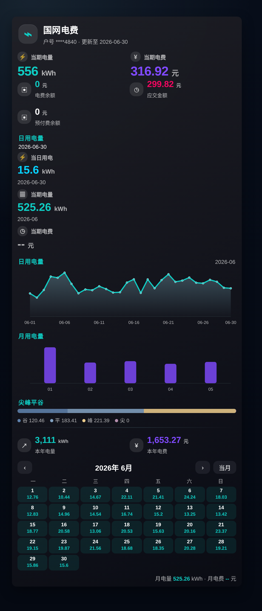
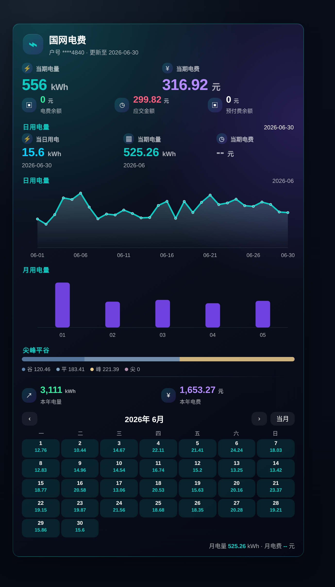
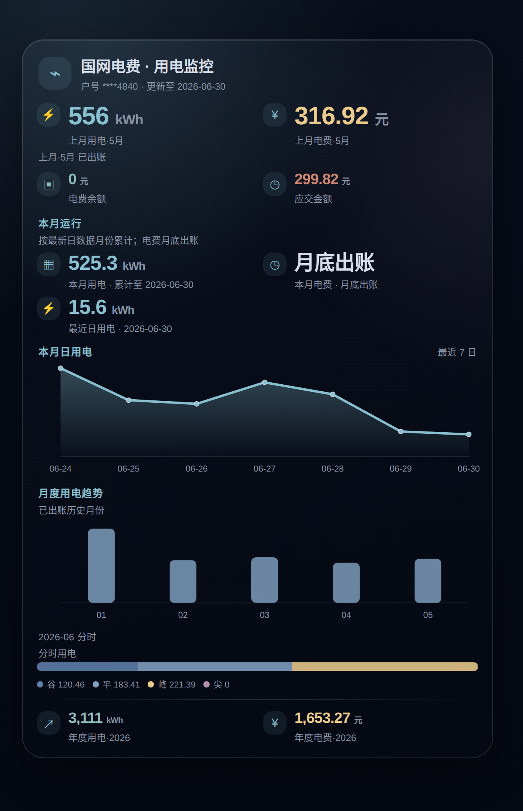

# state_grid / xiaoshi Lovelace 迁移说明

`lxg20082008/state_grid` 仓库本身没有内置 Lovelace 卡片、YAML 或前端源码，README 里的仪表盘主要是截图。

但 `xiaoshi930/state_grid_info` / `xiaoshi930/xiaoshi` 这条生态确实有前端卡片，例如：

```yaml
type: custom:xiaoshi-state-grid-info
```

这张卡片依赖的是 `sensor.state_grid_<户号>` 这类单实体，以及它的 `daylist` / `monthlist` / `yearlist` 属性。本项目的数据模型不同：历史数据在本项目 `history` 实体的 `daily` / `monthly` 属性里，余额、月度、年度、峰平谷尖也分别是独立实体。

所以这里不在后端直接伪装成 `state_grid` 模型。

原因：

- `state_grid` / `state_grid_info` 依赖 `sensor.state_grid_<户号>` 单实体；
- xiaoshi 卡片读取 `daylist` / `monthlist` / `yearlist`；
- 本项目使用自己的实体命名，历史数据放在 `daily` / `monthly`；
- 后端额外发布一套 `state_grid` 实体会影响实体命名、MQTT discovery、REST 兼容层和现有卡片，维护成本会变成两套模型。

## 可用方案

### 1. 已有 `state_grid` 仪表盘 YAML：离线字段替换

```bash
python tools/convert_state_grid_lovelace.py input.yaml output.yaml --account-no 你的13位户号
```

脚本会根据完整户号在本机计算 canonical `末四位_稳定摘要` 账户键，再替换常见 `state_grid` 实体，并把图表里的 `attributes.graph` 按上下文替换为本项目历史实体的 `daily` / `monthly`。完整户号不会写入输出。已从 Home Assistant 或日志确认账户键时，也可改用 `--entity-key <末四位_稳定摘要>`；不要填写只有末四位的旧身份。

转换后仍建议检查一次 YAML，特别是自定义 `data_generator` 里对单条数据字段名的读取逻辑。

### 2. 只想要卡片：使用内置示例

```text
examples/lovelace-cards/sgcc-electricity-card-xiaoshi-original.yaml
examples/lovelace-cards/sgcc-electricity-card-xiaoshi-style.yaml
examples/lovelace-cards/sgcc-electricity-card.yaml
```

说明：

- `sgcc-electricity-card-xiaoshi-original.yaml` 是消逝 / xiaoshi 原版风格预设，已替换成本项目实体字段；
- `sgcc-electricity-card-xiaoshi-style.yaml` 是本项目字段适配的消逝风格卡片；
- `sgcc-electricity-card.yaml` 是当前自用 Lovelace 页面配置，来自 `/sgcc-electricity/overview`。

截图示例：

| 示例 | 截图 |
| --- | --- |
| 消逝 / xiaoshi 原版风格预设 |  |
| 消逝风格优化版 |  |
| 当前自用卡片（overview） |  |
